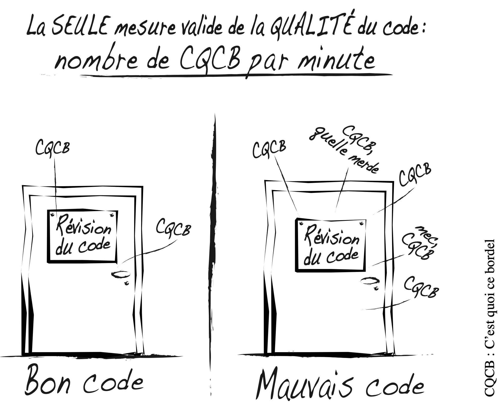
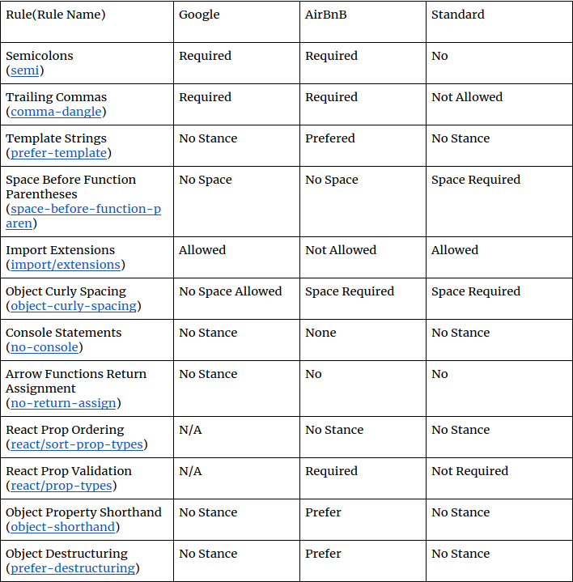

<style>
.row {
  display: flex;
}

.col {
  flex: 50%;
}

.col:not(:last-child) {
	margin-right: 3rem;
}

.align-right {
  text-align: right;
}

.clean-logo {
  position:absolute;                 
  bottom:1rem;                         
  right:1rem;
  width: 2rem
}

.citation__name {
  font-weight: bold;
  font-style: italic;
}

.citation__text {
  font-style: italic;
}

.citation_image {
  max-width: 66%;
  text-align: center;
}

</style>

# **Clean Code**

## Écrire du code propre & maintenable <!--fit-->


---

# Outline

- Outcomes
- What does it mean to be clean?
- What is Clean Code?
- Bad Code Dumpster Dive
- Names
- Functions
- Demonstration: Cleaning Code
- Comments
- Formatting
- Practice
- Exercises
- Some tools

---

# Outcomes

After this class students will be able to:

1. recognize the elements of bad code, including within functions, classes,arguments, and comments.
2. review code with an eye towards cleanliness and design.
3. plan and execute code cleanup without risk to the application.
4. incrementally improve bad design choices.
5. be much more aware of the quality of the code they, and their team-mates are writing.

---

# What does it mean to be clean?

- The business cost of bad code.
  - The Productivity Roller-Coaster.
  - Race to the Bottom.
  - The Grand-Redesign Myth.
- Why Does Code Rot?
- The Only Way to go Fast

---

# What is Clean Code?

---

## Elegance

<div class="row">
  <div class="col align-right">
    <div class="citation__text">
    I like my code to be elegant and efficient<br/>Clean code does one thing well 
    </div>
    <br/>
    <p class="citation__name">Bjarne Stroustrup</p>
  </div>
  <div class="col">
    
  </div>
</div>

---

## Simple, Direct & Prose

<div class="row">
  <div class="col align-right">
    <div class="citation__text">
    Clean code is simple and direct <br/>Clean code reads like well-written prose
    </div>
    <br/>
    <p class="citation__name">Grady Booch</p>
  </div>
  <div class="col">
    
  </div>
</div>

---

## Literate

<div class="row">
  <div class="col align-right">
    <div class="citation__text">
    Clean code can be read<br/>Clean code should be literate
    </div>
    <br/>
    <p class="citation__name">Dave Thomas</p>
  </div>
  <div class="col">
    
  </div>
</div>

---

## Care

<div class="row">
  <div class="col align-right">
    <div class="citation__text">
    Clean code always looks like it was written by someone who cares 
    </div>
    <br/>
    <p class="citation__name">Michael Feathers</p>
  </div>
  <div class="col">
    
  </div>
</div>

---

## Small, expressive, simple

<div class="row">
  <div class="col align-right">
    <div class="citation__text">
    Reduced duplication, high expressiveness, and early building of, simple abstractions 
    </div>
    <br/>
    <p class="citation__name">Ron Jeffries</p>
  </div>
  <div class="col">
    
  </div>
</div>

---

## What you expected

<div class="row">
  <div class="col align-right">
    <div class="citation__text">
    You know you are working on clean code when each routine you read turns out to be pretty much what you expected
    </div>
    <br/>
    <p class="citation__name">Ward Cunningham</p>
  </div>
  <div class="col">
    
  </div>
</div>

---

## They Boy Scout Rule

<div class="row">
  <div class="col align-right">
    <div class="citation__text">
      Check the code in cleaner than you checked it out.
    </div>
    <br/>
    <p class="citation__name">Robert C. Martin "Uncle Bob"</p>
  </div>
  <div class="col">
    
  </div>
</div>

---



---

# Bad Code Dumpster Dive

```javascript class:"lineNo"
function testableHtml(pageData, includeSuiteSetup) {
  const wikiPage = pageData.getWikiPage();
  let buffer = new StringBuffer();
  if (pageData.hasAttribute("Test")) {
    if (includeSuiteSetup) {
      const suiteSetup = PageCrawlerImpl.getInheritedPage(
        SuiteResponder.SUITE_SETUP_NAME,
        wikiPage
      );
      if (suiteSetup != null) {
        const pagePath = suiteSetup.getPageCrawler().getFullPath(suiteSetup);
        const pagePathName = PathParser.render(pagePath);
        buffer.append("!include -setup .").append(pagePathName).append("\n");
      }
    }
    const setup = PageCrawlerImpl.getInheritedPage("SetUp", wikiPage);
    if (setup != null) {
      const setupPath = wikiPage.getPageCrawler().getFullPath(setup);
      const setupPathName = PathParser.render(setupPath);
      buffer.append("!include -setup .").append(setupPathName).append("\n");
    }
  }
  buffer.append(pageData.getContent());
  if (pageData.hasAttribute("Test")) {
    const teardown = PageCrawlerImpl.getInheritedPage("TearDown", wikiPage);
    if (teardown != null) {
      const tearDownPath = wikiPage.getPageCrawler().getFullPath(teardown);
      const tearDownPathName = PathParser.render(tearDownPath);
      buffer
        .append("\n")
        .append("!include -teardown .")
        .append(tearDownPathName)
        .append("\n");
    }
  }
}
```

---

# Bad Code Dumpster Dive

```javascript {.line-numbers}
function renderPageWithSetupsAndTeardowns(pageData, isSuite) {
  const isTestPage = pageData.hasAttribute("Test");
  if (isTestPage) {
    const testPage = pageData.getWikiPage();
    let newPageContent = new StringBuffer();
    includeSetupPages(testPage, newPageContent, isSuite);
    newPageContent.append(pageData.getContent());
    includeTeardownPages(testPage, newPageContent, isSuite);
    pageData.setContent(newPageContent.toString());
  }
  return pageData.getHtml();
}
```


---

# Noms significatifs

---

## Use Intention-Revealing Names

```javascript
public List<int[]> getThem() {
  List<int[]> list1 = new ArrayList<int[]>();
  for (int[] x : theList)
    if (x[0] == 4) list1.add(x);
      return list1;
}
```

---

## Use Intention-Revealing Names

```javascript
public List<Cell> getFlaggedCells() {
List<Cell> flaggedCells = new ArrayList<Cell>();
for (Cell cell : gameBoard)
  if (cell.isFlagged()) flaggedCells.add(cell);
    return flaggedCells;
}
```


---

## Avoid Disinformation

```javascript
int a = l;
if (O == l)
  a = O1;
else
  l = 01;
```

## Make Meaningful Distinctions

```javascript
public static void copyChars(char a1[], char a2[]) {
  for (int i = 0; i < a1.length; i++) {
    a2[i] = a1[i];
  }
 }
```

---

## Use Pronounceable Names

```javascript
class DtaRcrd102 {
  private Date genymdhms;
  private Date modymdhms;
  private final String pszqint = "102"; /* ... */
};
```

---

## Use Pronounceable Names

```javascript
class Customer {
  private Date generationTimestamp;
  private Date modificationTimestamp;
  private final String recordId = "102"; /* ... */
};
```


---
## Use Searchable Names
```javascript
    for (int j = 0; j < 34; j++) {
      s += (t[j] * 4) / 5;
    }
```
---

## Use Searchable Names

```javascript
    int realDaysPerIdealDay = 4;
    const int WORK_DAYS_PER_WEEK = 5;
    int sum = 0;
    for (int j = 0; j < NUMBER_OF_TASKS; j++) {
    int realTaskDays = taskEstimate[j] * realDaysPerIdealDay;
    int realTaskWeeks = (realdays / WORK_DAYS_PER_WEEK);
    sum += realTaskWeeks;
```


---

## Member Prefixes (Avoid encodings)

```javascript
    public class Part {
      private String m_dsc; // The textual description

      void setName(String name) {
        m_dsc = name;
      }
    }
```

## Hungarian Notation (Avoid encodings)

```javascript
      PhoneNumber phoneString;
      // name not changed when type changed!
```

---

## Member Prefixes (Avoid encodings)

```javascript
    public class Part {
      String description;

      void setDescription(String description) {
        this.description = description;
      }
    }
```

## Hungarian Notation(Avoid encodings)

```javascript
PhoneNumber phone;
```


---

## Avoid Mental Mapping

```javascript
    for (a = 0; a < 10; a++)
      for (b = 0; b < 10; b++)
```

## Class Names

```javascript
Manager, Processor, Data, Info
```

---

## Avoid Mental Mapping

```javascript
  for (i = 0; i < 10; i++)
    for (j = 0; j < 10; j++)
```

## Class Names

```javascript
  Customer, WikiPage, Account, AddressParser
  // a class name should not be a verb
```


---

## Method Names

```javascript
    postPayment, deletePage, save
    // methods should have verb or verb phrase names
    
    string name = employee.getName();
    customer.setName("mike");

    if (paycheck.isPosted())...

    Complex fulcrumPoint = Complex.fromRealNumber(23.0);
    // is generally better than
    Complex fulcrumPoint = new Complex(23.0);
```


---

## Pick One Word per Concept

```javascript
    fetch, retrieve, get // as equivalent methods

    controller, manager, driver // confusing
```
## Don’t Pun
```javascript
    // avoid using the same word for two purposes
```


---

## Use Solution Domain Names

```javascript
    AccountVisitor, JobQueue
    // people who read your code will be programmers
```
## Add Meaningful Context
```javascript
    firstName, lastName, street, city, state, zipcode
    
    // a better solution
    addrFirstName, addrLastName, addrState
    
    // a better solution
    Class Address
```


---

## Don’t Add Gratuitous Context

```javascript
    Address
    // is a fine name for a class
    AccountAddress, CustomerAddress
    // are fine names for instances of the class Address
    // but could be poor names for classes
    
    MAC addresses, port addresses, Web addresses
    
    // a better solution
    PostalAddress, MAC, URI
```


---

# Functions

---

# Demonstration: Cleaning Code

---

# Commentaires

---

# Formatting: Mise en forme

---

# Practice

---

# Exercises

---
# Quelques outils
---
## Prettier
- [Prettier](https://prettier.io/docs/en/index.html) is an opinionated code **formatter**.
- Formatter = a tools that scans your files for style issues and automatically reformats your code to ensure consistent rules
- **Formating rules**: e.g. `max-len`, `no-mixed-spaces-and-tabs`, `keyword-spacing`, `comma-style`, etc.
```javascript
foo(reallyLongArg(), omgSoManyParameters(), IShouldRefactorThis(), isThereSeriouslyAnotherOne());
```
```javascript
foo(
  reallyLongArg(),
  omgSoManyParameters(),
  IShouldRefactorThis(),
  isThereSeriouslyAnotherOne());
```
---
## ESLint
- [ESLint](https://eslint.org/) is the most popular JavaScript **linter**
- Linter = a tool that scans code for errors and in some instances can fix them automatically
- Error can include:
  - Coding errors that lead to bugs
  - Stylistic errors
- **Code-quality rules**: eg `no-unused-vars`, `no-extra-bind`,`no-implicit-globals`, `prefer-promise-reject-errors`, etc.
---
## Style Guides
### Javascript
- [JavaScript Standard Style](https://standardjs.com/)
- [Airbnb JavaScript Style Guide() {](https://github.com/airbnb/javascript)
- [eslint-config-google](https://github.com/google/eslint-config-google#readme)
### React
- [ESLint-plugin-React](https://github.com/yannickcr/eslint-plugin-react)
- [Airbnb React/JSX Style Guide](https://github.com/airbnb/javascript/tree/master/react)
### API
- [Google](https://cloud.google.com/apis/design)
- [Microsoft](https://docs.microsoft.com/en-us/azure/architecture/best-practices/api-design)
---
